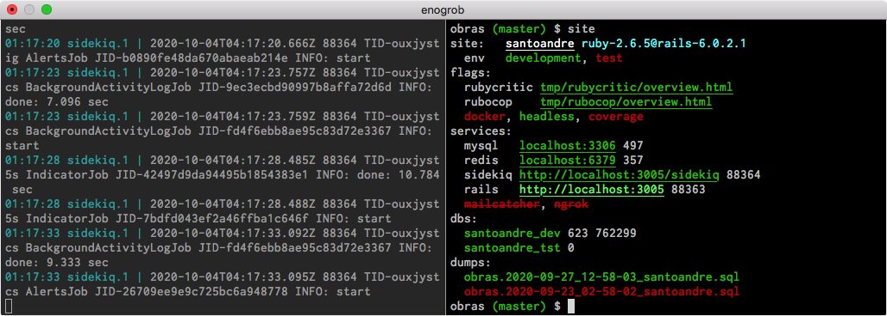

```
Roberto Nogueira  
BSd EE, MSd CE
Solution Integrator Experienced - Certified by Ericsson
```
# Research Obras DevTools


**About**

This in order to improve the Obras Development Process, developing utilities and support for [**Foreman**](https://github.com/ddollar/foreman), [**Docker**](https://www.docker.com/) and  editors [**VsCode**](https://code.visualstudio.com/) and [**Rubymine**](https://www.jetbrains.com/ruby/). 

**Advantages:**

* Development Flux and Environment seamlessly Integrated with **Docker**
* Automatic **db** update
* Live **db, servers, testing** information
* **Progress bars** and **spinners** for long tasks duration
* Supports for OSX and Linux
* Supports [**NGrok**](https://ngrok.com/) and [**Foreman**](https://github.com/ddollar/foreman)
* Extends use of [**chromeapps-for-eicon**](https://github.com/enogrob/chromeapps-eicon)
* Configurations support for [**Rubymine**](https://www.jetbrains.com/ruby/) and [**Vscode**](https://code.visualstudio.com/)

**Refs:**

* [1] [**Project Obras Devtools** in Github](https://github.com/enogrob/research-obras-devtools)
* [2] [**Pipe Viewer**](http://www.ivarch.com/programs/pv.shtml)
* [3] [**Library Ansi**](https://github.com/fidian/ansi)
* [4] [**Revolver**](https://github.com/molovo/revolver)
* [5] [**Z shell**](http://zsh.sourceforge.net/)

## Installation

**1.** Clone the `DevTools` repository

```shell
$ git clone git@github.com:enogrob/research-obras-devtools.git
```

**2.** Go to into `research-obras-devtools` directory.

```shell
$ cd research-obras-devtools
```

**3.** Define temporarily two enviroment variables specifying wwhere `obras` and `obras_old` is, for example:
Obs: As nowadays all sites are at same level, specify same location for both.  

* `obras` is the most actual location for the mainly project. 
* `obras_old` is the project folder for sites in older revision.

```shell
$ OBRAS=~/Projects/obras
$ OBRAS_OLD=~/Projects/obras
```

**4.** Run `install.sh` in order to install `DevTools` for `obras`:

```shell
$ ./install.sh obras_dir $OBRAS $OBRAS_OLD
$ ./install.sh obras
```

**5.** If you have not specify yet the `gemset` in the `obras` directories do it:
Obs: The underlying ruby has to be installed before, do `rvm list` in order to check. As nowadays the location are the same does just for one.

```shell
$ cd $OBRAS
$ rvm use ruby-2.6.5
$ rvm gemset create rails-6.0.2.1
$ rvm gemset list
$ rvm use --ruby-version ruby-2.6.5@rails-6.0.2.1
$ rvm current
$ gem list
$ rvm install rails -v '6.0.2.1'
```

**6.** reload the shell in order to take effect.

```shell
$ source ~/.bashrc
```

**7.** Below is a example to to prepare a site for use.

obs: Remember to register the `ssh` keys in **Engine Yard** in order to be able to download the dumps automatically.

```shell
$ santoandre
$ site db update
:
```


```
:
$ site start
```

In other shell. Check that is running.

```shell
$ site
:
```



**8.** In order to update from previous versions that does not contain `obras_utils` function does the following:

```shell
$ obras
$ test -f .fobras_utils.sh && rm -rf .fobras_utils.sh
$ wget https://raw.githubusercontent.com/enogrob/research-obras-devtools/master/obras/.fobras_utils.sh
$ source .fobras_utils.sh
$ fobras_utils update
```

**For further help:**

```shell
$ site --help
Crafted (c) 2013~2020 by InMov - Intelligence in Movement
Obras Utils 1.4.60
::
site [sitename || flags || set/unset flag|| env development/test]
site [check/ls || start/stop [sitename/all] || console || test || rspec]
site [ngrok || mailcatcher start/stop]
site [devtools_update]

$ site db --help
Crafted (c) 2013~2020 by InMov - Intelligence in Movement
Obras Utils 1.4.60
::
db [set sitename || ls || preptest/init || drop || create || migrate || seed || import [dbfile] || download || update [all]]
db [status || start || stop || restart || tables || databases || socket]
db [api [dump/export || import]]

$ obras_utils --help
Crafted (c) 2013~2020 by InMov - Intelligence in Movement
Obras Utils 1.4.60
::
obras_utils [version/update/check]
```